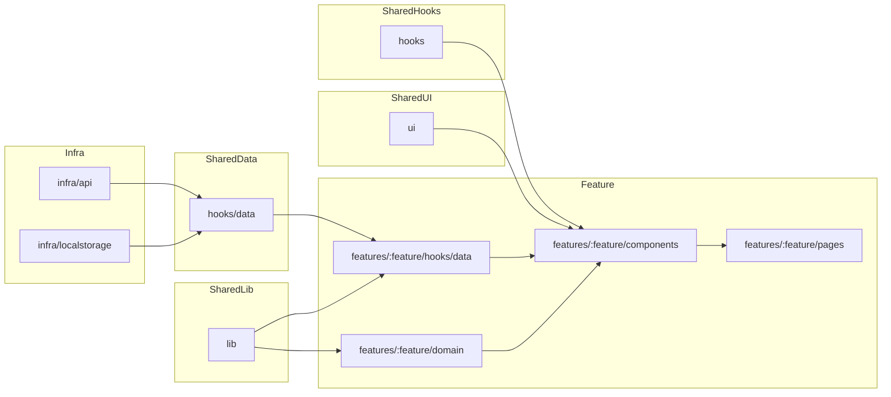

## 実装ガイドライン
- **バレルファイル運用**: `app/features/time-tracker/components/index.ts` など必要に応じた集約は任意。フレームワークを問わず、依存が循環しないよう責務ごとにモジュールを分離する。
- **テスト戦略**: ユニット/コンポーネントは Vitest + Testing Library、E2E は Playwright を使用し、TDD を基本とする。
- **アーキテクチャ原則**: 即時スタート体験を維持し、情報は段階的に開示し、`Session { id, title, startedAt, endedAt, durationSeconds, ... }` を共通スキーマとして扱う。

### ディレクトリとレイヤー方針
- `features/<feature-name>/` 配下で UI・ドメイン・データ取得を完結させる。`domain/` は計算やバリデーションなど副作用を持たないロジックのみ、`components/<Component>/` は UI とイベントを担い、再利用したい処理は同階層のサイドカーファイル（例: `logic.ts`, `*.hooks.ts`）へ切り出す。機能専用のクエリやミューテーションは `features/<feature>/hooks/data/` にまとめ、Presenter/Service レイヤーは導入しない。
- `components/<Component>/` ではフォーカス制御やキーボードショートカットなどの副作用を `useEffect` と `attach*` 系ヘルパーで閉じ込めつつ、親から受け取る props はデータとコールバックに限定する。
- アプリ全体で共有するデータ取得は `hooks/data/` に配置し、TanStack Query などの依存を閉じ込める。Feature 側からはこのフックを介して `infra/` の実装にアクセスする。
- UI ロジックの再利用フックは `hooks/` に置き、副作用の有無が分かる名前を付ける（例: `useIntersectionObserver.ts`）。状態管理と密結合なロジックは各機能配下に留める。
- `hooks/data/` で取得した state は原則として機能のページ/ルートコンポーネント（例: `features/<feature>/pages/...`）で受け取り、子コンポーネントへ props として渡す。
  - 受け渡すことになるpropsはなるべく最小になるようにロジックをよく検討する。
  - それでもprops が煩雑になる場合は、機能内に Context + Provider や `components/<Component>.hooks.ts` を用意してバケツリレーを緩和する。
  - 例外的に子コンポーネントから直接 `hooks/data/` を参照する場合は、外部依存を明示し乱用を避ける。
- 純粋関数やユーティリティは `lib/` へ集約し、副作用を持たないこととテスト併設を原則とする。
- プラットフォーム固有の実装（API クライアント、ストレージなど）は `infra/<subsystem>/` に配置し、原則として `hooks/data/` 経由で利用する。ディレクトリ名は `api/`, `localstorage/` など手段を明示する。
- デザインシステムや共有 UI コンポーネントは `ui/` に配置し、各機能からはプレゼンテーション目的でのみ参照する。機能固有の状態は `ui/` へ持ち込まない。
- 機能間の依存は最小限に留め、別機能を利用したい場合は `features/<feature>/index.ts` などで公開 API を経由する。

### ディレクトリ構成例
```
app
└── src
    ├── infra
    │   ├── api
    │   │   ├── httpClient.ts
    │   │   └── sessionApi.ts
    │   └── localstorage
    │       └── sessionStorage.ts
    ├── hooks
    │   ├── data
    │   │   └── useCurrentUser.ts
    │   ├── useIntersectionObserver.ts
    │   └── useEventListener.ts
    ├── lib
    │   ├── formatDuration.ts
    │   └── date.ts
    ├── ui
    │   ├── components
    │   │   ├── Button
    │   │   │   ├── Button.tsx
    │   │   │   └── Button.stories.tsx
    │   │   └── Modal
    │   │       ├── Modal.tsx
    │   │       └── Modal.hooks.ts
    │   └── tokens
    │       ├── colors.ts
    │       └── spacing.ts
    └── features
        └── time-tracker
            ├── components
            │   ├── RunningTimer
            │   │   ├── RunningTimer.tsx
            │   │   ├── RunningTimer.hooks.ts
            │   │   └── RunningTimer.test.tsx
            │   └── HistoryList
            │       ├── HistoryList.tsx
            │       ├── HistoryList.hooks.ts
            │       └── HistoryList.test.tsx
            ├── domain
            │   ├── session.ts
            │   └── sessionReducer.ts
            ├── hooks
            │   └── data
            │       ├── useSessionQueries.ts
            │       └── useSessionMutations.ts
            ├── pages
            │   ├── TimeTrackerPage.tsx
            │   └── TimeTrackerPage.test.tsx
            └── index.ts
```
- `features/<feature>/components/<ComponentName>/` は UI コンポーネント本体と、必要に応じて同階層の `logic.ts` や `*.hooks.ts` に切り出したロジックで構成する。ページ単位のエントリーポイントは `features/<feature>/pages/` に置き、必要なコンポーネントやデータフックを束ねる。
- `features/<feature>/hooks/data/` は機能専用のクエリやミューテーションを集約し、`domain/` や `components/` からの副作用を排除する。
- `hooks/data/` はアプリ全体で共有されるデータ取得フック（`useCurrentUser` など）を定義し、`infra/` の実装詳細をカプセル化する。
- `hooks/` には UI ロジック再利用用のカスタムフックをまとめ、副作用の有無が推測できる命名を採用する。
- `lib/` には純粋関数やフォーマッタを配置し、副作用を持たせない。
- `infra/<subsystem>/` は HTTP クライアントやブラウザストレージなど具体的な技術要素を管理し、原則 `hooks/data/` 経由で参照する。
- `ui/` は共有 UI とデザイントークンを提供し、機能側はプレゼンテーション用途でのみ参照する。

### Composer コンポーネント構成
- 入力値 (`inputValue`)、プロジェクトメニュー開閉 (`isProjectMenuOpen`)、検索クエリ (`projectQuery`) は `Composer.tsx` 内の `useState` で閉じ、進行中は `runningDraftTitle` を優先表示してエディタと同期する。app/features/time-tracker/components/Composer/Composer.tsx:56
- `handlePrimaryAction` では開始と停止を切り替え、`onStart` の真偽値で開始可否を判定し、`onStop` が返す `nextInputValue` と `nextProject` でフォーム状態を復元する。app/features/time-tracker/components/Composer/Composer.tsx:78, app/features/time-tracker/src/TimeTrackerPage.tsx:92
- プロジェクト候補は `buildProjectSuggestions` が重複排除と 12 件上限を担い、`filterSuggestions` がクエリに応じた部分一致フィルタを行う。app/features/time-tracker/components/Composer/Composer.tsx:69, app/features/time-tracker/components/Composer/logic.ts:8
- キーボード操作とフォーカス制御は `logic.ts` の `onEnterKey` / `onEnterOrMetaEnter` / `trapTabFocus` と、純粋関数ブロックと `attach*` ブロックに分けたヘルパーで宣言化し、`useEffect` から登録・解除する。app/features/time-tracker/components/Composer/Composer.tsx:102, app/features/time-tracker/components/Composer/logic.ts:49
- 親側ではプロジェクト同期を `handleComposerProjectChange` と `pendingComposerProjectRef` で扱い、停止後に履歴へ push したセッションのタイトル/プロジェクトを Composer に戻す。app/features/time-tracker/src/TimeTrackerPage.tsx:67, app/features/time-tracker/src/TimeTrackerPage.tsx:92

### 依存関係グラフ


### データアクセス規約
- データ取得・更新の副作用は `hooks/data/` または `features/<feature>/hooks/data/` のカスタムフックに集約し、TanStack Query などのクライアントはそこで初期化・利用する。
- テストでは `hooks/data/` 内のフックをモックし、UI／ドメインのテストからネットワークや永続化の詳細を隠蔽する。
- 永続化レイヤーを差し替える場合は `hooks/data/` 内の実装を切り替えることで対応し、UI やドメインへの影響を最小限に抑える。
