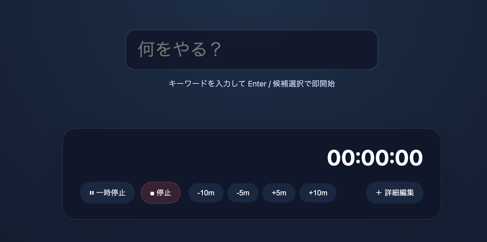

# Training Tracker（仮称）—要求設計 v0.6

最終更新: 2025-09-25 / 作成: あなた + ChatGPT

---

## 1. コンセプト / 目的

* **目的**: 技術・楽器など多領域の「鍛錬」を、Toggl のような軽快さで計測しつつ、**学習設計→実行→振り返り** を一気通貫で回せる個人向けタイムトラッカー。
* **差別化**: 単なる時間記録に留まらず、**スキル分解（技術/曲/練習メニュー/強度）** と紐付く。ポモドーロ/インターバル練習、RAGなメモ（根拠つきメモ）、OKR/目標に連動。
* **即時性の重視**: ユーザーが「やること」を**キーワードで入力した瞬間に計測が開始**される体験を中核に据える。摩擦ゼロの「即スタート」が本アプリの最も重要な価値。
* **あとから紐付け可能**: とりあえず計測を優先し、**終了後や後からプロジェクトやタグ、スキル、楽器を付与・編集**できる設計とする。これにより「記録しそびれ」を防ぎつつ、柔軟な集計が可能になる。
* **開始時間の柔軟編集**: 「あ、集計忘れてた」というケースに対応するため、セッション開始後でも**開始時刻を簡単に調整**できる。シンプルUIを保つため通常は非表示だが、オプションで展開して修正可能。
* **セッション中の編集性**: セッション中でも**タスク名称、タグ、スキル/プロジェクト**を即時修正できる。ただし基本UIはシンプルに保ち、詳細編集は折り畳み/展開式で提供する。
* **UI哲学**: Google 検索トップのように、**「入力フィールド1つだけ」のシンプルな計測開始画面**をトップに据える。余計な情報は排除し、「書いて即開始」の集中体験を保証する。
* **予測サジェスト**: 入力バーは過去のセッション、最近のスキル/プロジェクト/タグから**次にやる可能性の高いものをサジェスト**する。ユーザーは候補を選択するだけで即スタートできる。
* **アウトカム**: ①鍛錬時間の確保、②単位時間あたりの成果（アウトプット）向上、③継続性（習慣化）。

---

## 10. 画面/UX（主要フロー）

下記の画像くらいシンプルなものを想定

1. **ホーム（検索バー画面）**: 中央に1つの入力フィールドだけ配置。「何をやる？」を入力すると即時セッションが開始される。
    * 入力後 Enter でタイマー開始。
2. **計測中オーバーレイ**: 残り/経過、停止/ポーズに加えて、
    * **開始時刻の修正**（スライダー or カレンダーピッカーで柔軟に変更）
    * **タスク名称の修正**（インライン編集可能）
    * ただし初期表示は極力シンプル（「＋詳細編集」から展開する形）。

---

## 10.1 開始時刻入力 UX 案（軽快さ最優先）

**目的**: 「あ、集計忘れてた」に即応できる**最少操作**での開始時刻調整。

### A) クイックナッジ（デフォルト露出）

* **-10m / -5m / +5m / +10m** の4ボタンを常時表示（小さく目立たない）。
* 1タップ=その分だけ開始時刻を前後にシフト。
* 長押しで連続シフト（加速 1x→2x→4x）。

### B) スクラムバー（隠し詳細）

* **水平スクラバー**で開始時刻を前後にドラッグ（目盛: 1分）。
* シフト幅が大きい場合は**スナップ**（5/10/30分単位）。
* 現在時刻との差（+XXm / -YYm）をリアルタイム表示。

### アクセシビリティ

* スクリーンリーダー向けに「開始時刻 調整 -5分」などラベル化。
* フォーカスリング明示、操作は全てキーボード完結可能。

---

## 追加要件（柔軟編集関連）

* **セッション中編集**: 記録中でもタスク名/タグ/開始時刻を編集可能。
* **直感的操作**: 開始時刻はドラッグスライダーや「-5分/+10分」ボタンで調整。
* **非表示デフォルト**: 開始時刻・詳細タグ編集は折り畳み式で普段は隠す。
* **Undoサポート**: 誤操作時の即時取り消し（1段階）。

**受け入れ条件（例）**

* 期間とプロジェクトを選ぶと、サンプル画像同等の列が正しく算出される
* 予算未設定日は 0 として扱われる
* セッションが同日に複数あっても実績は合算される
* CSV ダウンロードが可能
