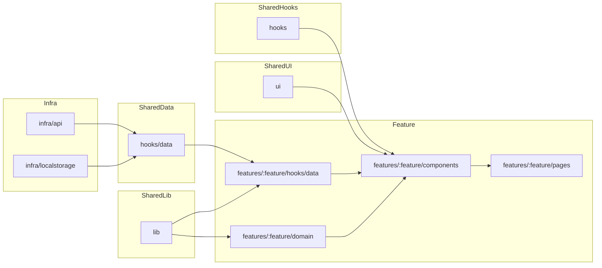

# Frontend Architecture

> このドキュメントは `app/.eslintrc.cjs` 等の司法（ガードレール）の「人間向け表現」です。
> SSoTは各設定ファイルとテストコードです。

## 実装ガイドライン

- **バレルファイル運用**: `app/features/time-tracker/components/index.ts` など必要に応じた集約は任意。フレームワークを問わず、依存が循環しないよう責務ごとにモジュールを分離する。
- **テスト戦略**: ユニット/コンポーネントは Vitest + Testing Library、E2E は Playwright を使用し、TDD を基本とする。
- **アーキテクチャ原則**: 即時スタート体験を維持し、情報は段階的に開示し、`Session { id, title, startedAt, endedAt, durationSeconds, ... }` を共通スキーマとして扱う。

## ディレクトリとレイヤー方針

> 司法: `app/.eslintrc.cjs` の `import/no-internal-modules` ルール

- `features/<feature-name>/` 配下で UI・ドメイン・データ取得を完結させる。`domain/` は計算やバリデーションなど副作用を持たないロジックのみ、`components/<Component>/` は UI とイベントを担い、再利用したい処理は同階層のサイドカーファイル（例: `logic.ts`, `*.hooks.ts`）へ切り出す。機能専用のクエリやミューテーションは `features/<feature>/hooks/data/` にまとめ、Presenter/Service レイヤーは導入しない。
- `components/<Component>/` ではフォーカス制御やキーボードショートカットなどの副作用を `useEffect` と `attach*` 系ヘルパーで閉じ込めつつ、親から受け取る props はデータとコールバックに限定する。
- アプリ全体で共有するデータ取得は `hooks/data/` に配置し、TanStack Query などの依存を閉じ込める。Feature 側からはこのフックを介して `infra/` の実装にアクセスする。
- UI ロジックの再利用フックは `hooks/` に置き、副作用の有無が分かる名前を付ける（例: `useIntersectionObserver.ts`）。状態管理と密結合なロジックは各機能配下に留める。
- `hooks/data/` で取得した state は原則として機能のページ/ルートコンポーネント（例: `features/<feature>/pages/...`）で受け取り、子コンポーネントへ props として渡す。
  - 受け渡すことになるpropsはなるべく最小になるようにロジックをよく検討する。
  - それでもprops が煩雑になる場合は、機能内に Context + Provider や `components/<Component>.hooks.ts` を用意してバケツリレーを緩和する。
  - 例外的に子コンポーネントから直接 `hooks/data/` を参照する場合は、外部依存を明示し乱用を避ける。
- 純粋関数やユーティリティは `lib/` へ集約し、副作用を持たないこととテスト併設を原則とする。
- プラットフォーム固有の実装（API クライアント、ストレージなど）は `infra/<subsystem>/` に配置し、原則として `hooks/data/` 経由で利用する。ディレクトリ名は `api/`, `localstorage/` など手段を明示する。
- デザインシステムや共有 UI コンポーネントは `ui/` に配置し、各機能からはプレゼンテーション目的でのみ参照する。機能固有の状態は `ui/` へ持ち込まない。
- 機能間の依存は最小限に留め、別機能を利用したい場合は `features/<feature>/index.ts` などで公開 API を経由する。

## ディレクトリ構成例

```
app
└── src
    ├── infra
    │   ├── api
    │   │   ├── httpClient.ts
    │   │   └── sessionApi.ts
    │   └── localstorage
    │       └── sessionStorage.ts
    ├── hooks
    │   ├── data
    │   │   └── useCurrentUser.ts
    │   ├── useIntersectionObserver.ts
    │   └── useEventListener.ts
    ├── lib
    │   ├── formatDuration.ts
    │   └── date.ts
    ├── ui
    │   ├── components
    │   │   ├── Button
    │   │   │   ├── Button.tsx
    │   │   │   └── Button.stories.tsx
    │   │   └── Modal
    │   │       ├── Modal.tsx
    │   │       └── Modal.hooks.ts
    │   └── tokens
    │       ├── colors.ts
    │       └── spacing.ts
    └── features
        └── time-tracker
            ├── components
            │   ├── RunningTimer
            │   │   ├── RunningTimer.tsx
            │   │   ├── RunningTimer.hooks.ts
            │   │   └── RunningTimer.test.tsx
            │   └── HistoryList
            │       ├── HistoryList.tsx
            │       ├── HistoryList.hooks.ts
            │       └── HistoryList.test.tsx
            ├── domain
            │   ├── session.ts
            │   └── sessionReducer.ts
            ├── hooks
            │   └── data
            │       ├── useSessionQueries.ts
            │       └── useSessionMutations.ts
            ├── pages
            │   ├── TimeTrackerPage.tsx
            │   └── TimeTrackerPage.test.tsx
            └── index.ts
```

## 依存関係グラフ



## データアクセス規約

- データ取得・更新の副作用は `hooks/data/` または `features/<feature>/hooks/data/` のカスタムフックに集約し、TanStack Query などのクライアントはそこで初期化・利用する。
- テストでは `hooks/data/` 内のフックをモックし、UI／ドメインのテストからネットワークや永続化の詳細を隠蔽する。
- 永続化レイヤーを差し替える場合は `hooks/data/` 内の実装を切り替えることで対応し、UI やドメインへの影響を最小限に抑える。
- 状態初期化は reducer に閉じ込め、UI 側は必要な情報を payload で渡す（例: セッション開始時にタイトル・プロジェクトを渡し、ID 生成や正規化は reducer で行う）。
- 外部サービスとの連携は Worker などサーバー側 API に委譲し、ブラウザから直接 SDK を呼び出さない。フロントは現状の draft／state をそのまま送るだけにして、フォーマット統一や列解決などの責務はサーバー側で担保する。
- テストケース名・E2E シナリオ名は日本語で記述し、ユーザー視点の挙動が一読して分かるようにする。Playwright テストでも gapi モックではなくローカルストレージや Worker API のモックを活用する。

---

## Running Session同期機能

### 概要

Running状態のセッションを複数デバイス間およびGoogle Sheetsとリアルタイムに同期する機能を実装。セッションIDを開始時に生成し、完了まで不変とする**Immutable ID Design**を採用。

### P1: デバイス間同期（Supabase）

**目的**: 複数デバイスでRunning中のセッションを共有し、どのデバイスからでも編集・停止できるようにする

**実装概要**:
- `features/time-tracker/hooks/data/useRunningSession.ts`
  - セッション開始時に`crypto.randomUUID()`でIDを生成
  - 状態変更時に`persistRunningState()`で自動保存
  - マウント時に`fetchRunningState()`でリモート状態を取得
  - シグネチャベースの差分検出で不要な同期を抑制

**データ構造**:
```typescript
type SessionDraft = {
  id: string;              // 開始時に生成、完了まで不変
  title: string;
  startedAt: number;
  project?: string;
  tags?: string[];
  skill?: string;
  intensity?: 'low' | 'medium' | 'high';
  notes?: string;
};

type RunningSessionState =
  | { status: 'idle'; draft: null; elapsedSeconds: 0 }
  | { status: 'running'; draft: SessionDraft; elapsedSeconds: number };
```

### P2: Google Sheets同期

**目的**: Running中のセッション情報をGoogle Sheetsにリアルタイム反映し、外部ツールからの可視化を実現

**実装概要**:
- `infra/google/googleSheetsRunningSync.ts`
  - `appendRunningSession()`: 開始時に新しい行を追加（status="Running"）
  - `updateRunningSession()`: Running中の更新（debounce 1秒）
  - `completeRunningSession()`: 完了時にstatus="Completed"に変更

### テスト戦略

> 司法: `app/tests/e2e/` のE2Eテスト

**ユニットテスト**:
- `googleSheetsRunningSync.test.ts`: Google Sheets API呼び出しのモック検証
- `useGoogleSpreadsheetSync.running.test.tsx`: フック動作の検証
- `useRunningSession.sync.test.tsx`: Supabase同期の検証

**E2Eテスト**:
- `running-session-sync.spec.ts`: マルチデバイス同期のシミュレーション
- `google-sheets-sync.spec.ts`: Google Sheets API モックとの統合
