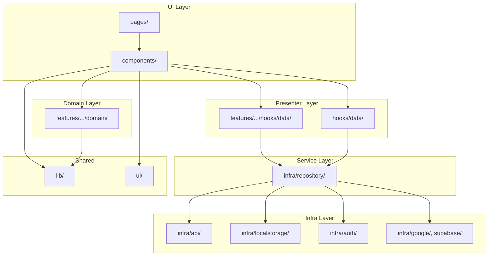

# レイヤー構造ガイド

> このドキュメントは `app/.eslintrc.cjs` 等の司法（ガードレール）の「人間向け表現」です。
> SSoTは各設定ファイルです。

## レイヤー一覧

### 依存方向（上から下への一方向のみ許可）

```
┌─────────────────────────────────────────┐
│ UI Layer                                │
│   features/<feature>/pages/             │
│   features/<feature>/components/        │
├─────────────────────────────────────────┤
│ Presenter Layer                         │
│   features/<feature>/hooks/data/        │
│   hooks/data/                           │
├─────────────────────────────────────────┤
│ Domain Layer                            │
│   features/<feature>/domain/            │
├─────────────────────────────────────────┤
│ Service Layer                           │
│   infra/repository/                     │
├─────────────────────────────────────────┤
│ Infra Layer                             │
│   infra/<subsystem>/                    │
└─────────────────────────────────────────┘
```

## 各レイヤーの責務

### UI Layer

**配置**: `features/<feature>/pages/`, `features/<feature>/components/`

**責務**:
- プレゼンテーション（表示）
- ユーザーインタラクション（イベント処理）
- 副作用の閉じ込め（useEffect, attach*系ヘルパー）

**制約**:
- 親から受け取るpropsはデータとコールバックに限定
- 機能固有の状態はui/へ持ち込まない
- 外部APIを直接呼び出さない

### Presenter Layer

**配置**: `features/<feature>/hooks/data/`, `hooks/data/`

**責務**:
- 状態管理（TanStack Query等）
- データ取得・更新の調整
- UIコンポーネント用のprops構築

**制約**:
- infra層への窓口として機能
- ネットワークやストレージの詳細はここに閉じ込める

### Domain Layer

**配置**: `features/<feature>/domain/`

**責務**:
- 純粋なビジネスロジック（計算、バリデーション）
- 型定義（Entity, Value Object）
- Reducer / State Machine

**制約**:
- 副作用を持たない（純粋関数のみ）
- 外部依存なし

### Service Layer

**配置**: `infra/repository/`

**責務**:
- データソース抽象化（Repository Pattern）
- 複数データソースの統合

**制約**:
- Presenter層からのみ利用される
- 具象実装の詳細を隠蔽

### Infra Layer

**配置**: `infra/<subsystem>/`

**責務**:
- プラットフォーム固有の実装
- APIクライアント（`infra/api/`）
- ストレージ（`infra/localstorage/`）
- 認証（`infra/auth/`）
- 外部サービス連携（`infra/google/`, `infra/supabase/`）

**制約**:
- ディレクトリ名は手段を明示（api/, localstorage/等）
- Repository経由で利用

### 共有レイヤー

#### lib/

**責務**: 純粋ユーティリティ（副作用なし）

**制約**:
- テスト併設を原則とする
- どのレイヤーからも参照可能

#### ui/

**責務**: デザインシステム、共有UIコンポーネント

**制約**:
- プレゼンテーション目的でのみ参照
- 機能固有の状態を持ち込まない

## 依存関係の可視化



## 違反の検出

> 司法: `app/.eslintrc.cjs` の `import/no-internal-modules` ルール

依存方向の違反はESLintによって自動検出されます。

```bash
cd app && pnpm lint
```
